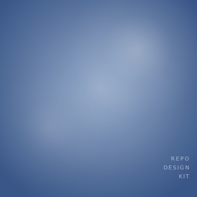
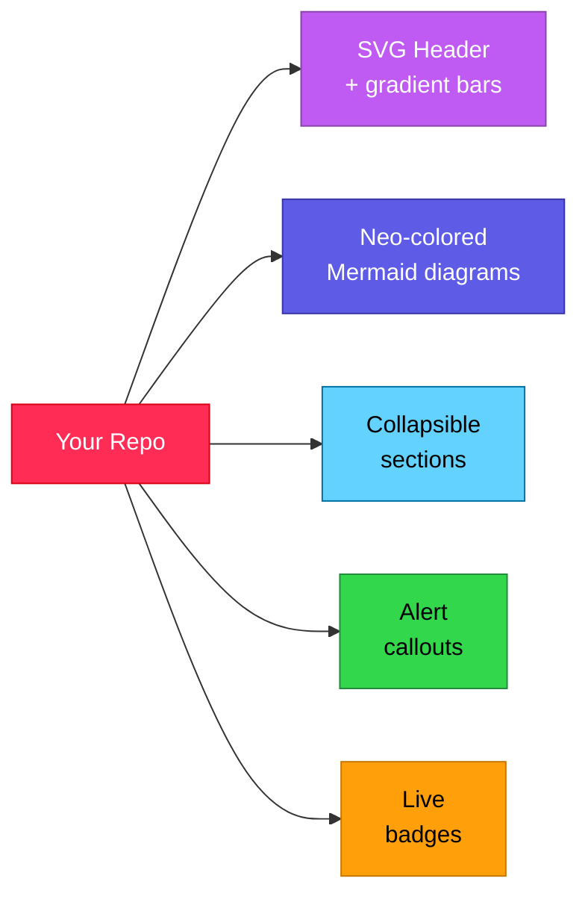
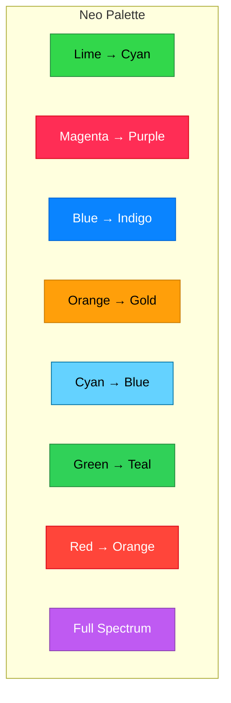
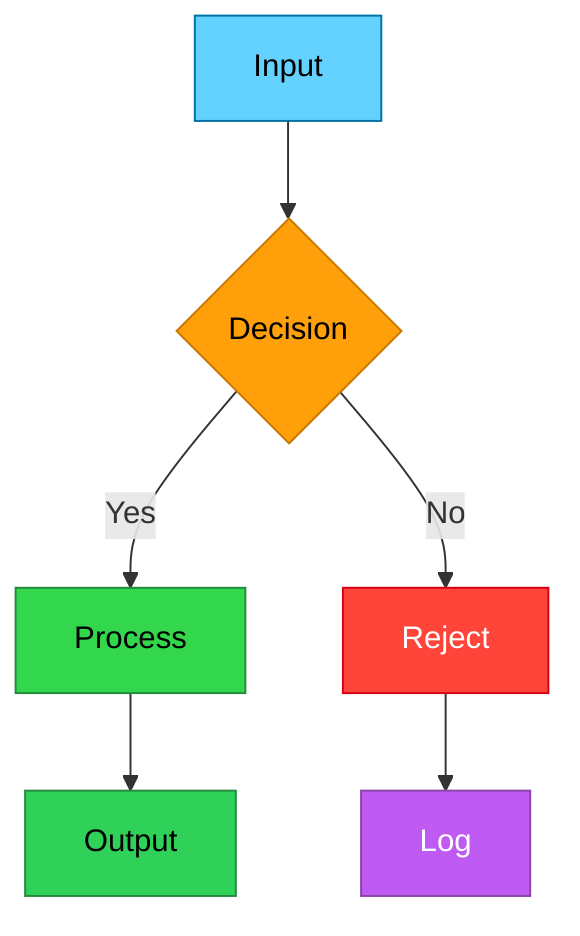
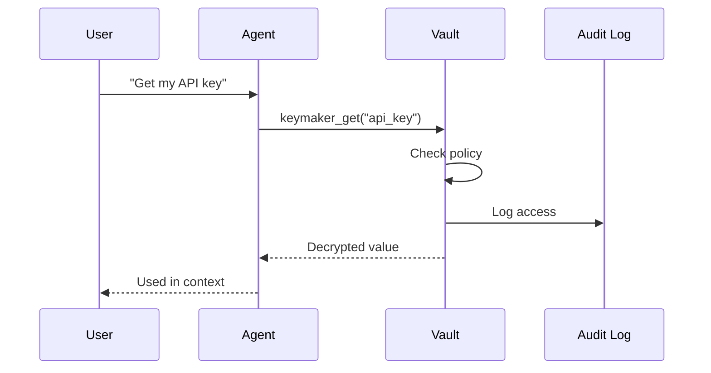
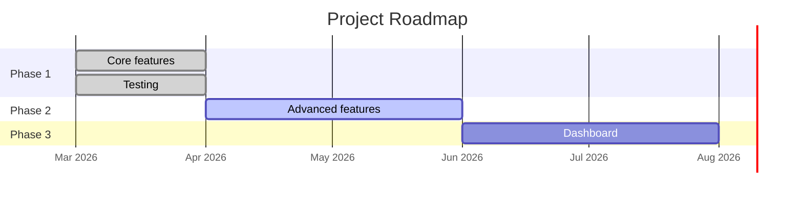
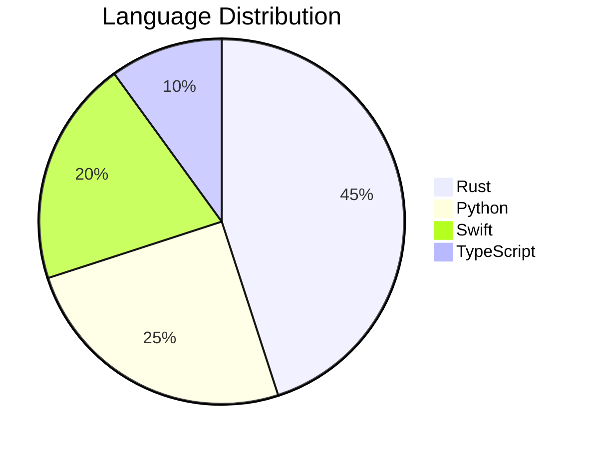
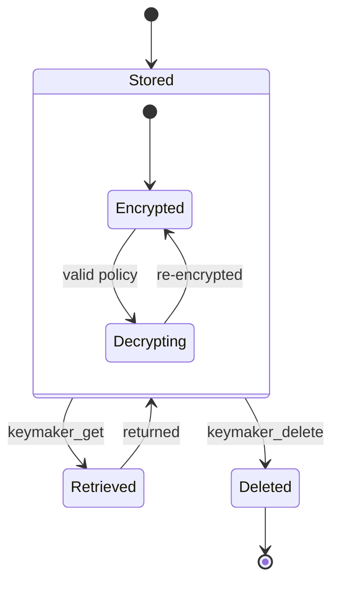
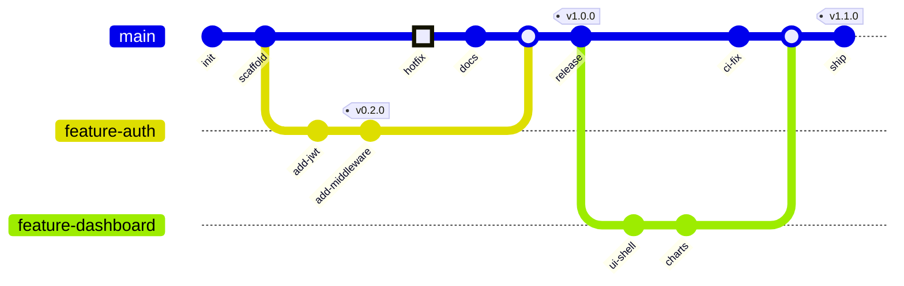

<p align="center">
  <picture>
    <source media="(prefers-color-scheme: dark)" srcset="docs/assets/header-dark.svg">
    <source media="(prefers-color-scheme: light)" srcset="docs/assets/header-light.svg">
    
  </picture>
</p>

<p align="center">
  
  
  
  
</p>

---

> [!TIP]
> Copy the `docs/assets/` folder and `README.md` template into your repo. Pick a gradient. Push. Done.

## What This Is

A collection of **SVG header skins**, **Mermaid diagram color palettes**, and **README templates** that make GitHub repos look polished — with dark/light mode support, gradient color bars, and every dynamic feature GitHub actually renders.

No build tools. No dependencies. Just SVG files and markdown.

---

## Before & After

**Before:** Plain text, no visual identity, blends in with 300 million other repos.

**After:**



---

## Table of Contents

- [Quick Start](#quick-start)
- [Skins](#skins)
- [Dynamic Features](#dynamic-features)
- [Mermaid Color Palettes](#mermaid-color-palettes)
- [Full Template](#full-template)
- [Included Files](#included-files)

---

## Quick Start

**1. Copy the template files into your repo:**

```bash
# Clone this repo
git clone https://github.com/qinnovates/repo-skin.git

# Copy what you need
cp -r repo-skin/docs/assets/ your-project/docs/assets/
cp repo-skin/templates/README.template.md your-project/README.md
```

**2. Edit the SVG header** — change the title text in `docs/assets/header-dark.svg` and `header-light.svg`:

```xml
<!-- Find this line and change the text -->
<text ... font-size="36" ...>YOUR PROJECT NAME</text>
```

**3. Pick a gradient** from the [Skins catalog](templates/skins/SKINS.md) and update the `<linearGradient>` stops.

**4. Push.** GitHub renders everything automatically.

---

## Skins

8 gradient palettes inspired by Apple's Neo Wallpaper collection. Each supports dark and light mode.



| Skin | Dark Mode Hex | Light Mode Hex | Suggested Use |
|------|--------------|----------------|---------------|
| **Lime Cyan** | `#32D74B` → `#64D2FF` | `#248A3D` → `#0071A4` | Dev tools, CLI |
| **Magenta Purple** | `#FF2D55` → `#BF5AF2` | `#D70015` → `#8944AB` | AI/ML, creative |
| **Blue Indigo** | `#0A84FF` → `#5E5CE6` | `#0064D2` → `#3634A3` | Mobile, design |
| **Orange Gold** | `#FF9F0A` → `#FFD60A` | `#C77800` → `#B25000` | Education |
| **Cyan Blue** | `#64D2FF` → `#0A84FF` | `#0071A4` → `#0064D2` | Data, APIs |
| **Green Teal** | `#32D74B` → `#30D158` | `#248A3D` → `#1E8E3E` | Health, nature |
| **Red Orange** | `#FF453A` → `#FF9F0A` | `#D70015` → `#C77800` | Security |
| **Full Spectrum** | `#FF2D55` → `#BF5AF2` → `#5E5CE6` → `#64D2FF` | `#D70015` → `#8944AB` → `#3634A3` → `#0071A4` | Flagship |

---

## Dynamic Features

Everything GitHub **actually** renders — tested and verified.[^1]

### Alert Callouts

```markdown
> [!NOTE]
> Useful information that users should know.

> [!TIP]
> Helpful advice for doing things better.

> [!IMPORTANT]
> Key information users need to know.

> [!WARNING]
> Urgent info that needs immediate attention.

> [!CAUTION]
> Negative potential consequences of an action.
```

> [!NOTE]
> These render with colored borders and icons on GitHub. Free visual hierarchy.

### Collapsible Sections

```html
<details>
<summary><strong>Click to expand</strong></summary>

Hidden content here. Markdown works inside.

- Bullet points
- Code blocks
- Even nested collapsibles

</details>
```

<details>
<summary><strong>Live example — click me</strong></summary>

This content is hidden by default. Use collapsible sections for:
- Verbose documentation
- Optional details
- FAQ answers
- Long code examples

</details>

### Nested Collapsibles (Accordion)

<details>
<summary><strong>Architecture</strong></summary>

<details>
<summary>Frontend</summary>

React, TypeScript, Tailwind...

</details>

<details>
<summary>Backend</summary>

Rust, Axum, SQLite...

</details>

<details>
<summary>Infrastructure</summary>

Docker, Cloudflare, GitHub Actions...

</details>

</details>

### Keyboard Keys

```markdown
Press <kbd>Ctrl</kbd> + <kbd>C</kbd> to copy.
```

Press <kbd>Ctrl</kbd> + <kbd>C</kbd> to copy.

### Footnotes

```markdown
This uses AES-256-GCM[^1] for encryption.

[^1]: Advanced Encryption Standard with Galois/Counter Mode.
```

Hover over the footnote number to see a preview. Click to jump to the definition.

### Dark/Light Mode Images

```html
<picture>
  <source media="(prefers-color-scheme: dark)" srcset="dark-image.svg">
  <source media="(prefers-color-scheme: light)" srcset="light-image.svg">
  
</picture>
```

GitHub automatically switches the image based on the user's theme.

### Star History Chart

Every public repo should include a star history graph. It's a live SVG that updates automatically — zero maintenance.

```markdown
[](https://star-history.com/#USER/REPO&Date)
```

Options:
- `&type=Date` — timeline view (default, best for most repos)
- `&type=Timeline` — compact timeline
- `&legend=top-left` — move legend position

Multiple repos in one chart:
```markdown
[](https://star-history.com/#USER/REPO1&USER/REPO2&Date)
```

> [!NOTE]
> The chart is a live SVG from star-history.com — it updates automatically as your repo gains stars. No CI or build step needed.

### Math (LaTeX)

Inline: `$E = mc^2$` → $E = mc^2$

Block:
```
$$
\sum_{i=1}^{n} x_i = x_1 + x_2 + \cdots + x_n
$$
```

$$\sum_{i=1}^{n} x_i = x_1 + x_2 + \cdots + x_n$$

---

## Mermaid Color Palettes

GitHub renders Mermaid diagrams natively. Here are copy-paste palettes using the Neo colors.

### Flowchart



### Sequence Diagram



### Gantt Chart



### Pie Chart



### State Diagram



### Decision Tree



### Copy-Paste Style Block

Use this style block in any Mermaid diagram for consistent Neo colors:

```
    style NodeA fill:#32D74B,stroke:#248A3D,color:#000
    style NodeB fill:#64D2FF,stroke:#0071A4,color:#000
    style NodeC fill:#FF9F0A,stroke:#C77800,color:#000
    style NodeD fill:#BF5AF2,stroke:#8944AB,color:#fff
    style NodeE fill:#FF453A,stroke:#D70015,color:#fff
    style NodeF fill:#FF2D55,stroke:#D70015,color:#fff
    style NodeG fill:#5E5CE6,stroke:#3634A3,color:#fff
    style NodeH fill:#FFD60A,stroke:#C77800,color:#000
```

---

## Full Template

<details>
<summary><strong>Copy-paste README template</strong></summary>

```markdown
<p align="center">
  <picture>
    <source media="(prefers-color-scheme: dark)" srcset="docs/assets/header-dark.svg">
    <source media="(prefers-color-scheme: light)" srcset="docs/assets/header-light.svg">
    
  </picture>
</p>

<p align="center">
  <a href="LICENSE.md"></a>
  
</p>

---

> [!TIP]
> One-line quick start instruction here.

## The Problem

What pain does this solve? Be specific. Show the broken state.

## How It Works

` ` `mermaid
graph TD
    A["Step 1"] --> B["Step 2"] --> C["Step 3"]
    style A fill:#64D2FF,stroke:#0071A4,color:#000
    style B fill:#32D74B,stroke:#248A3D,color:#000
    style C fill:#BF5AF2,stroke:#8944AB,color:#fff
` ` `

## Quick Start

` ` `bash
git clone ...
cd ...
make build
` ` `

<details>
<summary><strong>Detailed Setup</strong></summary>

Extended setup instructions here...

</details>

## Features

| Feature | Description |
|---------|-------------|
| **Feature 1** | What it does |
| **Feature 2** | What it does |

<details>
<summary><strong>Architecture</strong></summary>

` ` `mermaid
graph TD
    ...
` ` `

</details>

## Roadmap

| Phase | Status | Features |
|-------|--------|----------|
| 1 | Done | Core |
| 2 | Active | Advanced |
| 3 | Planned | Dashboard |

## License

[MIT](LICENSE.md)

---

<p align="center">Built by <a href="https://github.com/USER">You</a></p>
```

</details>

---

## Included Files

```
repo-skin/
├── docs/
│   └── assets/
│       ├── header-dark.svg          # Full Spectrum gradient (dark mode)
│       └── header-light.svg         # Full Spectrum gradient (light mode)
├── templates/
│   ├── skins/
│   │   └── SKINS.md                 # All 8 gradient palettes with hex values
│   └── README.template.md           # Copy-paste README scaffold
├── .gitignore                       # Hardened for secrets & PII
├── LICENSE.md                       # MIT
└── README.md                        # This file (also serves as a live demo)
```

---

## What GitHub Cannot Render

Before you try — these **do not work** in GitHub markdown:

| Feature | Why |
|---------|-----|
| Inline CSS (`style=""`) | Stripped by GitHub sanitizer |
| `<font color="">` | Stripped |
| `<style>` blocks | Stripped |
| JavaScript | Blocked by CSP |
| Animated SVG (JS) | JS blocked inside SVGs |
| `<iframe>` | Blocked |
| ANSI color codes | Ignored in markdown |
| `<marquee>` | Stripped |
| Hover tooltips | `title` attributes stripped from most elements |

**The workaround for all color/visual needs: SVG files referenced via `` or `<picture>`.** That's what this repo provides.

---

<p align="center">
  Built by <a href="https://github.com/qinnovates">Qinnovate</a>
</p>

[^1]: Tested on GitHub.com as of March 2026. GitHub occasionally adds new markdown features — check [GitHub's docs](https://docs.github.com/en/get-started/writing-on-github) for the latest.
