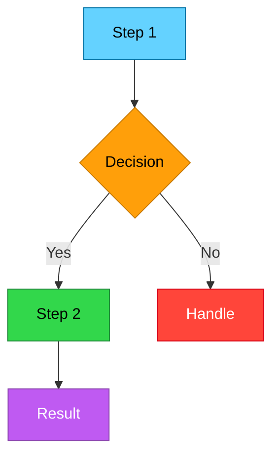
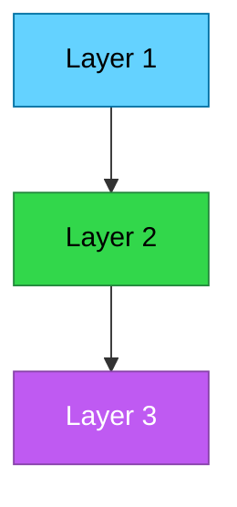

<!--
  REPO SKIN TEMPLATE

  Instructions:
  1. Replace PROJECT_NAME, USER, REPO, DESCRIPTION, LANGUAGE throughout
  2. Edit docs/assets/header-dark.svg and header-light.svg with your project name
  3. Pick a gradient from templates/skins/SKINS.md
  4. Delete this comment block
-->

<p align="center">
  <picture>
    <source media="(prefers-color-scheme: dark)" srcset="docs/assets/header-dark.svg">
    <source media="(prefers-color-scheme: light)" srcset="docs/assets/header-light.svg">
    
  </picture>
</p>

<p align="center">
  <a href="LICENSE.md"></a>
  
</p>

---

> [!TIP]
> QUICK_START_ONE_LINER

## The Problem

DESCRIPTION_OF_PAIN_POINT

## How It Works



---

## Quick Start

```bash
# Install
INSTALL_COMMAND

# Run
RUN_COMMAND
```

> [!NOTE]
> FIRST_RUN_NOTE

---

## Features

| Feature | Description |
|---------|-------------|
| **Feature 1** | What it does |
| **Feature 2** | What it does |
| **Feature 3** | What it does |

---

<details>
<summary><strong>Architecture</strong></summary>



```
src/
├── main file
├── module_a/
└── module_b/
```

</details>

<details>
<summary><strong>Configuration</strong></summary>

| Setting | Default | Description |
|---------|---------|-------------|
| `SETTING_1` | `value` | What it controls |

</details>

---

## Roadmap

| Phase | Status | Features |
|-------|--------|----------|
| 1 | Done | Core functionality |
| 2 | Active | Advanced features |
| 3 | Planned | Dashboard / UI |

---

## Star History

[](https://star-history.com/#USER/REPO&Date)

---

## Development

```bash
LANGUAGE_BUILD_COMMAND     # Build
LANGUAGE_TEST_COMMAND      # Test
LANGUAGE_LINT_COMMAND      # Lint
```

---

## License

[MIT](LICENSE.md)

---

<p align="center">Built by <a href="https://github.com/USER">USER</a></p>
