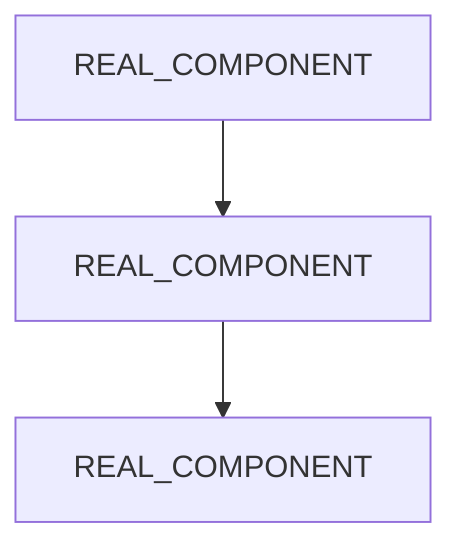

<!--
  beautiful-basic-template — repo-design-kit

  Instructions:
  1. Replace PROJECT_NAME, USER, REPO, LANGUAGE, VERSION throughout
  2. Pick a skin from templates/skins/SKINS.md — use its hex codes for badges
  3. Choose your variant (library / tool / application) — delete the others
  4. Delete this comment block when done

  No SVGs needed. No design files. Just markdown + shields.io badge colors.

  AI DOCUMENTATION GUIDE:
  If you are an AI assistant filling in this template, follow these rules:

  DO:
  - Describe what the project ACTUALLY DOES in concrete terms
  - Use the project's real file names, real commands, real output
  - State the differentiator with proof (benchmark, code sample, comparison)
  - Document every file in the repo that a user would interact with
  - Write section headers that describe content ("Atom/Stanza Engine" not "How It Works")
  - List what's in the repo with a file tree — readers should know what they're looking at

  DO NOT:
  - Use generic section headers: "The Problem", "The Solution", "Key Features",
    "How It Works", "Getting Started", "Overview", "Introduction", "About"
  - Use adjectives to describe the project (robust, comprehensive, seamless, powerful)
  - Write aspirational copy ("unlock the power of...", "your all-in-one solution")
  - Add sections the project hasn't earned (Roadmap with no items, Contributing with no contributors)
  - Include placeholder text — if you don't know, leave the placeholder token for the human
  - Over-document obvious things — Quick Start should be 2-3 lines max
  - Use emoji as section decoration (rockets, sparkles, lightbulbs)

  ANTI-PATTERNS (vibecheck G146 will flag these):
  ## The Problem / ## The Solution / ## Key Features / ## Why X?
  ## Getting Started / ## What Makes X Special / ## Overview / ## Introduction

  The best READMEs market through demonstration, not declaration.
-->

<h1 align="center">PROJECT_NAME</h1>
<p align="center"><em>ONE_LINE_TAGLINE</em></p>

<p align="center">
  <a href="LICENSE.md"></a>
  
  
</p>

---

<!--
  2-3 sentences. First = what it does. Second = how it's different.
  No adjectives. Concrete advantage with evidence.
-->

WHAT_IT_DOES_IN_ONE_SENTENCE. Unlike ALTERNATIVE, PROJECT_NAME CONCRETE_DIFFERENCE.

---

## Quick Start

```bash
INSTALL_COMMAND
RUN_COMMAND
```

---

<!-- ═══════════ VARIANT: LIBRARY ═══════════
     For pip/npm/cargo packages. Delete other variants. -->

## Usage

```LANGUAGE
IMPORT_STATEMENT

MINIMAL_WORKING_EXAMPLE
```

## API

| Function | Description |
|----------|-------------|
| `function_1()` | What it does |

<!-- ═══════════ VARIANT: CLI TOOL ═══════════
     For command-line tools. Delete other variants. -->

## Commands

```bash
COMMAND --flag     # description
COMMAND --other    # description
```

<!-- ═══════════ VARIANT: APPLICATION ═══════════
     For deployed apps/services. Delete other variants. -->

## Deploy

```bash
DEPLOY_COMMAND
```

<!-- ═══════════ END VARIANTS ═══════════ -->

---

## What's in the Repo

<!--
  AI: Use the ACTUAL file tree. Not a generic template.
  Run `ls` or `find` and document what's really there.
-->

```
REPO/
├── src/            ← DESCRIBE
├── tests/          ← DESCRIBE
├── REAL_FILE       ← DESCRIBE
└── REAL_FILE       ← DESCRIBE
```

---

<!--
  Only include if >3 components with non-obvious relationships.
  Use REAL component names. Delete if single-file project.
-->
<details>
<summary><strong>Architecture</strong></summary>



</details>

---

## Contributing

See [CONTRIBUTING.md](CONTRIBUTING.md).

## License

[MIT](LICENSE.md)

---

<p align="center">Built by <a href="https://github.com/USER">USER</a></p>
<p align="center"><sub>Template: <a href="https://github.com/qinnovates/repo-design-kit">beautiful-basic-template</a></sub></p>
