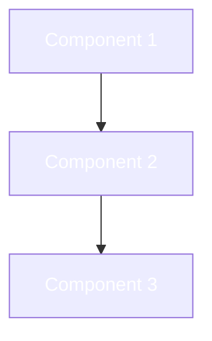

<!--
  README TEMPLATE — repo-design-kit

  Instructions:
  1. Replace PROJECT_NAME, USER, REPO, LANGUAGE, VERSION throughout
  2. Edit docs/assets/header-dark.svg and header-light.svg with your project name
  3. Pick a gradient from templates/skins/SKINS.md
  4. Choose your variant sections (library / tool / application)
  5. Delete this comment block and any variant sections you don't use
-->

<p align="center">
  <picture>
    <source media="(prefers-color-scheme: dark)" srcset="docs/assets/header-dark.svg">
    <source media="(prefers-color-scheme: light)" srcset="docs/assets/header-light.svg">
    
  </picture>
</p>

<p align="center"><em>ONE_LINE_TAGLINE — technical descriptor, not aspirational</em></p>

<p align="center">
  <a href="LICENSE.md"></a>
  
  
</p>

---

## Why PROJECT_NAME?

<!-- 3-5 sentences max. State the problem, then immediately state what makes your approach different. -->

THE_PROBLEM_IN_ONE_SENTENCE.

PROJECT_NAME solves this by DIFFERENTIATOR. Unlike ALTERNATIVE, it CONCRETE_ADVANTAGE.

---

## Quick Start

```bash
# Install
INSTALL_COMMAND

# Run
RUN_COMMAND
```

> [!NOTE]
> FIRST_RUN_NOTE

---

<!-- ============================================================
     VARIANT: LIBRARY — use this section for libraries/packages
     Delete the other two variant sections
     ============================================================ -->

## Usage

```LANGUAGE
IMPORT_STATEMENT

// Minimal working example — copy-pasteable
USAGE_EXAMPLE
```

## API

| Function | Description |
|----------|-------------|
| `function_1()` | What it does |
| `function_2()` | What it does |
| `function_3()` | What it does |

<!-- ============================================================
     VARIANT: CLI TOOL — use this section for CLI tools
     Delete the other two variant sections
     ============================================================ -->

## Usage

```bash
# Core commands
COMMAND_1     # What it does
COMMAND_2     # What it does
COMMAND_3     # What it does
```

<!-- Optional: demo GIF or screenshot -->
<!--  -->

<!-- Optional: benchmarks (numbers only, no adjectives) -->
<!-- ## Benchmarks
| Tool | Time | Memory |
|------|------|--------|
| PROJECT_NAME | Xms | YMB |
| Alternative | Xms | YMB | -->

<!-- ============================================================
     VARIANT: APPLICATION — use this section for applications
     Delete the other two variant sections
     ============================================================ -->

## Getting Started

```bash
# Deploy
DEPLOY_COMMAND
```

## Features

| Feature | Description |
|---------|-------------|
| **Feature 1** | What it does |
| **Feature 2** | What it does |
| **Feature 3** | What it does |

<!-- Optional: screenshot -->
<!--  -->

<!-- ============================================================
     END VARIANTS — everything below is shared
     ============================================================ -->

---

<!-- Optional: only include if the project has non-obvious runtime topology -->
<details>
<summary><strong>Architecture</strong></summary>



</details>

<!-- Optional: only include if there are real alternatives worth comparing against -->
<!-- Use numbers and verifiable claims only — no adjectives -->
<details>
<summary><strong>Compared to alternatives</strong></summary>

| | PROJECT_NAME | Alternative 1 | Alternative 2 |
|--|---|---|---|
| Feature A | Yes | No | Yes |
| Feature B | Xms | Yms | Zms |

</details>

---

## Contributing

See [CONTRIBUTING.md](CONTRIBUTING.md) for development setup and guidelines.

## License

[MIT](LICENSE.md)

---

<p align="center">Built by <a href="https://github.com/USER">USER</a></p>
<p align="center"><sub>README template from <a href="https://github.com/qinnovates/repo-design-kit">repo-design-kit</a></sub></p>
